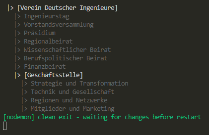

[zurück](../README.md)

## :arrow_forward: S1D4 - Vererbung und Typprüfung
Lead: @stan1025 (Andreas Stutz)  
Status: :heavy_check_mark:  
geplant: KW16  

---
### Einleitung:

In diesem Dojo lernen wir nun den VDI ein wenig von seiner Struktur kennen.
Vererbung ist eines der wichtigsten Werkzeuge in der objekt-orientierten Programmierung. Hierfür schauen wir uns nun die ehrenamtliche Struktur des Vereins Deutscher Ingenieure an.  

Hier schonmal die Links die euch einen Einblik in das geben, was wir nun programmiertechnisch umsetzen möchten. 

[VDI Organisation](https://www.vdi.de/ueber-uns/organisation)  
[Ehrenamtsstruktur](https://www.vdi.de/ueber-uns/organisation/ehrenamtliche-struktur)

---
### Aufgabe 1 - Erstelle eine vereinfachte Klasse 'Mensch'

Ein Verein besteht aus einer Gruppe Menschen die im Sinne des Vereins die gleichen Ziele verfolgen. Aus diesem Grund und zur Wiederholdung von letzter Woche, legen wir eine vereinfachte Klasse Mensch an. Folgende Informationen soll die Klasse Mensch haben:
- Titel (string)
- Vorname (string)
- Nachname (string)

Führe hierfür folgende Schritte aus:

- [ ] Erstelle eine Datei namens `Mensch.ts` im Ordner `S1D4`
- [ ] Erstelle eine `export class` namens 'Mensch'
- [ ] Lege die genannten öffentlichen Informationen an
- [ ] Erstelle einen Constructor, der die entsprechenden Informationen setzt

[Literatur - Klassen](https://www.typescriptlang.org/docs/handbook/2/classes.html#class-members)
[Literatur - Eigenschaften](https://www.typescriptlang.org/docs/handbook/2/classes.html#fields)  

### Aufgabe 2 - Erstelle eine Klasse 'Mitglied'

Ein Verein besteht aus einer Gruppe Menschen, wobei diese die Besonderheit aufweisen, dass sie Mitglieder des Vereins sind. Aus diesem Grund nutzen wir nun die Möglichkeit der Ableitung und schaffen somit die Klasse `Mitglied` mit folgenden Informationen:
- Mitgliedsnummer (number)

Führe hierfür folgende Schritte aus:

- [ ] Erstelle eine Datei namens `Mitglied.ts` im Ordner `S1D4`
- [ ] Erstelle eine Klasse namens `Mitglied` die von der Klasse `Mensch` erbt.
- [ ] Lege die genannten Mitglieder-spezifischen Informationen in der Klasse an
- [ ] Erstelle einen Constructor, der die Informationen der Klasse `Mensch` initialisiert, sowie die Informationen des `Mitglieds`. Die Mitgliedsnummer soll hierbei durch einen hochgezählten Counter erzeugt werden. Beachte hierfür die Aufgabe `S1D3#11`

[Literatur - Klassen](https://www.typescriptlang.org/docs/handbook/2/classes.html#class-members)  
[Literatur - Constructors with Super Calls](https://www.typescriptlang.org/docs/handbook/2/classes.html#super-calls)  
[Literatur - Vererbung (extends)](https://www.typescriptlang.org/docs/handbook/2/classes.html#extends-clauses)  
[Link zur Aufgabe S1D3#11](https://github.com/VDI-CodING/codeING-main/tree/master/section1/S1D3#11-wir-sind-ingenieure-und-uns-interessieren-zahlen-fakten-und-statistiken---static-property)  

### Aufgabe 3 - Erstelle eine Factory-Methode für ein `Mitglied`

Wie wir im letzten Block gelernt haben, gibt es die Möglichkeit mittelst statischer Methoden (sogenannten Factory-Methods) die Erzeugung eines Objekts zu vereinfachen. Aus diesem Grund ist die Aufgabe hier eine statische Methode in der Klasse `Mitglied` zu erstellen, die aus einem `Menschen` ein `Mitglied` macht.

- [ ] Erstelle eine Factory Methode, die aus einem `Mensch` eine `Mitglied` macht.

[Link zur Aufgabe S1D3#10](https://github.com/VDI-CodING/codeING-main/tree/master/section1/S1D3#10-wir-machen-uns-die-welt-ein-wenig-einfacher---static-methods)  

### Aufgabe 4 - Erstelle eine abstrakte Klasse `OrgEinheit`

Der VDI hat einzelne organisatorische Einheiten, die zum Teil eine eigene Untergliederung haben und einige nicht. Als Grundlage für eine organisatorische Einheit werden wir nun eine Klasse `OrgEinheit` anlegen, die folgende Informationen besitzt:
- Bezeichnung (string)
- Personen (Array of `Mensch`)
- Ebene (number)

Folgende Schritte sind für die Aufgabe auszuführen:

- [ ] Erstelle eine Datei namens `OrgEinheit.ts`
- [ ] Erstelle darin eine abstrakte Klasse `OrgEinheit`
- [ ] Erstelle darin die angegebenen öffentlichen Informationen
- [ ] Erstelle einen Construtor, der die entsprechenden Informationen setzt bzw initialisiert.

[Literatur - Abstract Class](https://www.typescriptlang.org/docs/handbook/2/classes.html#abstract-classes-and-members)
### Aufgabe 5 - Erstelle eine abstrakte Klasse `HierarchyOrgEinheit`

Nach dem die Klasse `OrgEinheit` die generische Klasse darstellt, folgt nun die Ergänzung zur Strukturierung der organisatorischen Einheiten als `HierarchyOrgEinheit`. Hierzu sind folgende Informationen der Klasse `HierarchyOrgEinheit` anzufügen, die die Klasse `OrgEinheit` erweitert (extends):
- Einheiten (Array of OrgEinheit)

Folgende Schritte sind für die Aufgabe auszuführen:

- [ ] Erstelle eine Datei namens `HierarchyOrgEinheit.ts`
- [ ] Erstelle darin eine abstrakte Klasse `HierarchyOrgEinheit` die von `OrgEinheit` erbt
- [ ] Erstelle darin die angegebenen öffentlichen Informationen
- [ ] Lege eine Methode `addEinheit` mit einem Parameter `einheit: OrgEinheit`. Berechne die korrekte Ebene der hinzugefügten Einheit und passe sie an.

[Literatur - Abstract Class](https://www.typescriptlang.org/docs/handbook/2/classes.html#abstract-classes-and-members)  

### Aufgabe 5 - Erstelle eine Print-Methode in der Klasse `OrgEinheit`

Erstelle eine öffentliche Methode Print, die in der Konsole die Bezeichnung der Organisationseinheit ausgibt. Hierzu ist folgendes Format zu wählen:

`{Padding}|> {Bezeichner}`

Padding beschreibt eine Menge an auffüllenden Zeichen zu Beginn des Strings. Hierzu ist die Ebene der Organistion mit dem Faktor 2 zu multiplizieren und eine entsprechende Anzahl von Leerzeichen ist dem String zu Beginn hinzuzufügen.

Der Bezeichner entspricht dem Bezeichner der OrgEinheit. 

Die Farbe in dem dieser String auszugeben ist Grau.

Folgende Aufgaben sind hierfür auszuführen:

- [ ] Erstelle eine Methode Print nach der gegebenen Funktionsbeschreibung

[Literatur - Methoden](https://www.typescriptlang.org/docs/handbook/2/classes.html#methods)  
[Literatur - Color Package](https://www.npmjs.com/package/colors)

### Aufgabe 6 - Erstelle eine Print-Methode in der Klasse `HierarchyOrgEinheit`

Nutze die Möglichkeit der Methoden-Überladung (Override), um die Print-Methode der Basisklasse zu überschreiben und zu ergänzen, dass folgendes Schema verwendet wird.

`{Padding}|> [{Bezeichner}]`

Padding ist identisch zur Aufgabe davor.

Der Bezeichner entspricht dem Bezeichner der OrgEinheit umklammert von eckigen Klammern.

Nach der Ausgabe der eigenen OrgEinheit-Bezeichnung ist über alle `Einheiten` der `HierarchyOrgEinheit` zu iterrieren und ebenfalls die Print-Methode auszuführen.

Folgende Aufgaben sind hierfür auszuführen:

- [ ] Erstelle eine Methode Print nach der gegebenen Funktionsbeschreibung

[Literatur - Methoden](https://www.typescriptlang.org/docs/handbook/2/classes.html#methods)  
[Literatur - Color Package](https://www.npmjs.com/package/colors)

### Aufgabe 7 - Erstelle eine Methode `AlleEinheiten` an der Klasse `HierarchyOrgEinheit`

Erstelle eine Methode die alle unterlagerten Instanzen einer `OrgEinheit` in einer flachen Liste zurückgibt. Die eigene Instanz soll ebenfalls Teil der Auflistung sein. 
Hierbei ist zu beachten, dass nicht jede `OrgEinheit` unterlagerte Einheiten hat - nutze hierzu den Hinweis zum `Type Checking` und des `as` Operator aus der angegebenen Literatur. 

Folgende Aufgaben sind hierfür auszuführen:

- [ ] Erstelle die Methode `AlleEinheiten` entsprechend der geforderten Funktion.

[Literatur - Methoden](https://www.typescriptlang.org/docs/handbook/2/classes.html#methods)  
[Literatur - Schleifen](https://www.tutorialspoint.com/typescript/typescript_loops.htm)  
[Literatur - Type Checking](https://www.typescriptlang.org/docs/handbook/2/narrowing.html#instanceof-narrowing)  
[Literatur - Type Mapping with As](https://www.typescriptlang.org/docs/handbook/2/mapped-types.html#key-remapping-via-as)  

### Aufgabe 8 - Erstelle folgende Klassen und Methoden

Erstelle eine Klasse VDITeam abgeleitet von der Klasse `OrgEinheit`.

- [ ] Erstelle die Datei `VDITeam.ts`
- [ ] Erstelle die Klasse `VDITeam`
- [ ] Erstelle eine Methode `joinMitglied` mit einem Parameter vom Typ `Mitglied`

Erstelle eine Klasse VDIEinheit abgeleitet von der Klasse `HierarchyOrgEinheit`.

- [ ] Erstelle die Datei `VDIEinheit.ts`
- [ ] Erstelle die Klasse `VDIEinheit`
- [ ] Erstelle eine Methode `addTeam` mit einem Parameter vom Typ `VDITeam`

Erstelle eine Klasse VDIVerein abgeleitet von der Klasse `HierarchyOrgEinheit`.

- [ ] Erstelle die Datei `VDIVerein.ts`
- [ ] Erstelle die Klasse `VDIVerein`

[Literatur - Klassen (mal eine andere Klassen-Quelle)](https://www.tutorialspoint.com/typescript/typescript_classes.htm)  

### Aufgabe 8 - Erstelle folgende Klasse und das Testprogramm 

Als Testprogramm ist durch die Klassen `VDIVerein`, `VDIEinheit`, `VDITeam` die ehrenamtliche Struktur des VDI abzubilden. Unter diesem Link findet ihr die Struktur die ihr nachbilden sollt:

[Ehrenamtsstruktur des VDI](https://www.vdi.de/ueber-uns/organisation/ehrenamtliche-struktur)

Folgende Schritte sind hierzu auszuführen:

- [ ] Erstelle die Datei `s1d4_test.ts`
- [ ] Erstelle die Klasse `S1D4Test` analog zur Klasse `S1D3Test`
- [ ] Erstelle die Methode `Execute` analog zur Klasse `S1D3Test`
- [ ] Programmiere die Methode `Execute` gemäß der Ehrenamtlichen Struktur
  - alle Organe sind als Instanz einer Einheiten unter dem Verein anzulegen, wenn sie weiter unterteilt werden
  - alle Organe sind als Instanz eines Teams unter dem Verein oder Einheiten anzulegen, wenn sie nicht weiter unterteilt werden
  - Rufe am Ende die Methode `Print` der Instance `Verein` auf
- [ ] Erstelle in der `app.ts` einen Aufruf der `S1D4Test.Execute`

Folgender Output sollte in der Console erscheinen:

